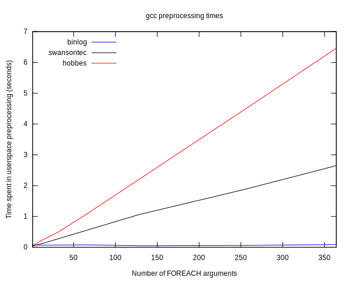
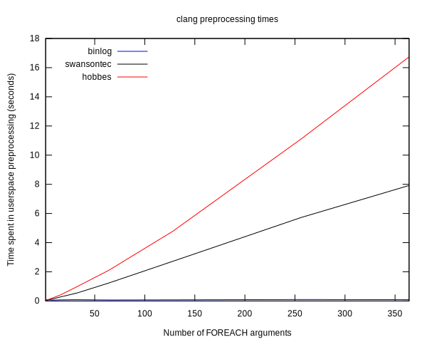

# Preprocessor FOREACH comparison

Assume you want to create a preprocessor macro that takes a macro `F`
and a variable number of arguments. When expanded, it invokes `F` with each argument:

```c
#define FOREACH(F, ...) //...

FOREACH(G, a, b, c) // expands to: G(a) G(b) G(c)
```

Such a macro can be useful for example for a log library.
There are several ways to implement it.
Here, we compare three different implementations,
with regard to complexity, ease of change, and compile time.

## Contenders

The first implementation is taken from **[binlog][]**.
It consists of a macro that counts the number of arguments,
and `N` foreach macros, one for each arity.
It is generated by a python script, `binlog.py`.
`N` is a parameter of the generator script, here, `N=512`.

The second implementation is taken from **[swansontec][]**.
It is a complex, but documented solution.
It works with up to `N=364` arguments. The idea can be expanded to
support more arguments.

The third implementation is taken from **[hobbes][]**.
It is a complex solution.
It works with up to `N=513` arguments, probably it can be changed
to support more.

[binlog]: http://binlog.org
[swansontec]: https://github.com/swansontec/map-macro
[hobbes]: https://github.com/morganstanley/hobbes/

## Compile time measurement

For each solution, a source file is generated, that includes the implementation,
and invokes foreach with `M` arguments, 32 times. Then the time the compiler spends
in user space, while preprocessing the file is measured.
Finally, measured time is plotted against the number of arguments:




## Verdict

The generated solution (binlog) is very fast to preprocess,
easy to understand, and easy to modify (e.g: pass around an extra data argument,
support zero arguments, increase `N`).
It requires an extra step to generate the header, that is otherwise large.
It is Apache 2.0 licensed.

The solution of swansontec is much slower to preprocess,
and gets linearly slower as the number of arguments increases.
It is difficult to understand or modify - but there's a documentation to it.
The implementation is short. It is public domain.

The solution of hobbes is even slower to preprocess.
It is difficult to understand or modify. I found no documentation that explains how it works.
The implementation is short.
It is Apache 2.0 licensed.
